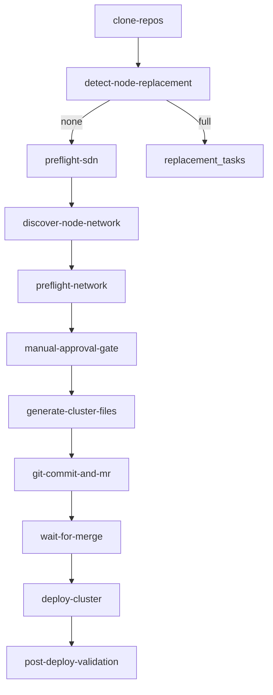
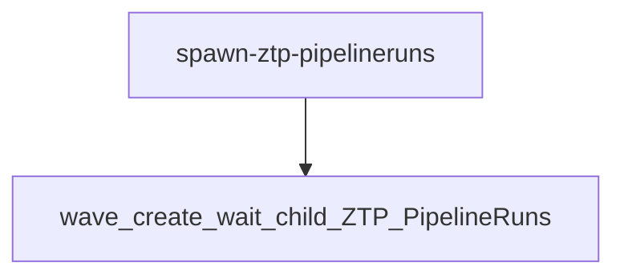
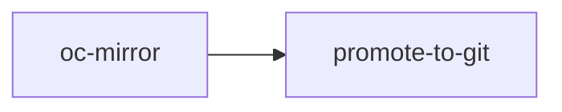
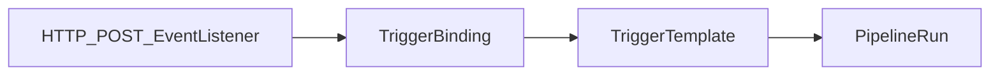

# Cluster automation (`cluster-automation/`)

| Path | Role |
|------|------|
| `spoke-automation/ztp-pipeline` | Single-cluster ZTP render + Git PR pipeline. |
| `spoke-automation/bulk-ztp-pipeline` | Fan-out over ACM `ManagedClusters` with bounded concurrency. |
| `spoke-automation/mirror-pipeline` | `oc mirror` + Git promotion of mirror metadata. |
| `spoke-automation/mirror-tenant-triggers` | Tekton Triggers — HTTP POST starts the mirror pipeline with a tenant-supplied `ImageSetConfiguration` ConfigMap. |
| `spoke-automation/ztp-node-replacement` | Legacy standalone node-replacement pipeline (prefer the integrated flow in `ztp-pipeline`). |
| `ztp-spoke` | Helm chart rendered by the ZTP pipeline (`ClusterInstance`, namespaces, etc.). |

## Pipeline task flow

### ztp-pipeline

### bulk-ztp-pipeline

### mirror-pipeline

### mirror-tenant-triggers

## Data flow

1. Operator commits `spoke-clusters/<env>/<site>/<hub>/99-pipeline-values/<cluster>.yaml`.
2. Tekton clones the repo, runs Ansible preflight (DNS, Redfish MAC discovery), then `helm template` against `ztp-spoke`.
3. Output is committed to `spoke-clusters/<env>/<site>/<hub>/clusters/<cluster>/manifests.yaml`.
4. ArgoCD `ApplicationSet` (from `hub-clusters/day2/app-of-apps`) syncs each `clusters/<cluster>/` directory to the hub.
