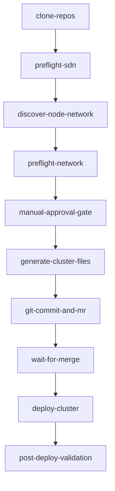
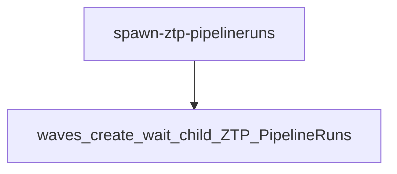
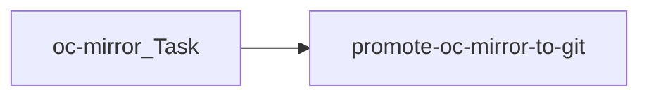
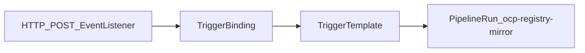
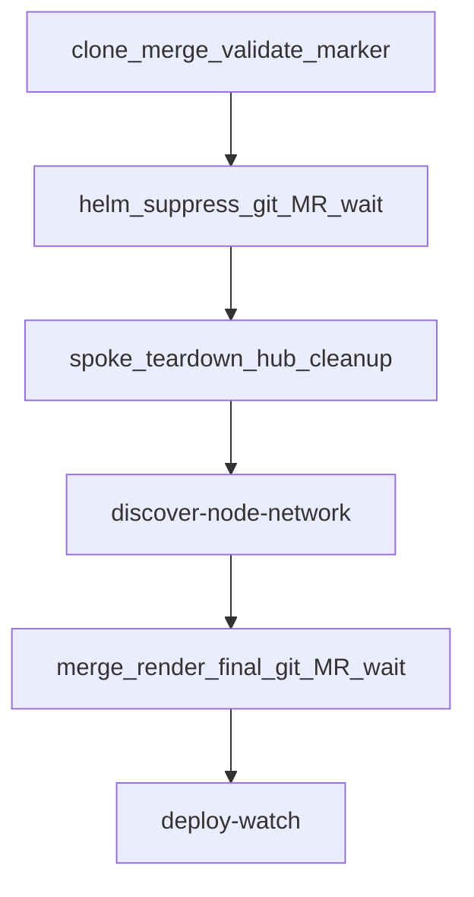

# Cluster automation (`cluster-automation/`)

Shared automation for building and updating spoke clusters.

## Layout

| Path | Role |
|------|------|
| **`spoke-automation/ztp-pipeline`** | Single-cluster ZTP render + Git PR pipeline (Tekton). |
| **`spoke-automation/bulk-ztp-pipeline`** | Bulk fan-out over managed clusters. |
| **`spoke-automation/mirror-pipeline`** | `oc mirror` workflow + Git promotion of mirror metadata. |
| **`spoke-automation/mirror-tenant-triggers`** | Tekton Triggers + HTTP → tenant-driven **`ocp-registry-mirror`** runs. |
| **`spoke-automation/ztp-node-replacement`** | Bare-metal node replacement Tekton pipeline (`replacementTarget`, suppress MR, teardown, discovery, final MR). |
| **`ztp-spoke`** | Helm chart rendered by ZTP (`ClusterInstance`, namespaces, etc.). |
| **`../custom-container-images/oc-mirror`** (see repo root) | Container image build for the mirror pipeline runner. |

## Pipeline diagrams

One **Mermaid** figure per Tekton pipeline (high-level task flow). Charts live under **`spoke-automation/<chart>/`**.

### ztp-pipeline ([README](spoke-automation/ztp-pipeline/README.md))

Single-cluster: clone Git → optional Ansible / gates → **`helm template`** → GitHub PR → optional merge wait → hub deploy watch → optional spoke validation.

### bulk-ztp-pipeline ([README](spoke-automation/bulk-ztp-pipeline/README.md))

Single Pipeline task **`spawn-ztp-pipelineruns`**: filter **ManagedClusters**, then create child **`ztp-pipeline`** **PipelineRuns** in waves (**max-concurrent**) and wait each wave until all succeed (**dry-run** lists targets only).

### mirror-pipeline ([README](spoke-automation/mirror-pipeline/README.md))

Run **`oc mirror`** using workspace **ImageSet**, then promote artifacts into Git (**hub values** / optional spoke policy manifest).

### mirror-tenant-triggers ([README](spoke-automation/mirror-tenant-triggers/README.md))

Not a Pipeline definition—it wires **Triggers** so HTTP **`POST`** starts pipeline **`ocp-registry-mirror`** with tenant **ConfigMap** ImageSet.

### ztp-node-replacement ([README](spoke-automation/ztp-node-replacement/README.md))

Suppress marked node in Git → merge MR → spoke teardown + etcd gate → discovery → final **`helm template`** + MR → optional deploy watch. (Detailed **`.mmd`** sources under [`spoke-automation/ztp-node-replacement/diagrams/`](spoke-automation/ztp-node-replacement/diagrams/).)

## Data flow

1. Operators commit **`spoke-clusters/<env>/<site>/<hub>/99-pipeline-values/<cluster>.yaml`**.
2. Tekton clones the repo, finds that file, runs **`helm template`** against **`ztp-spoke`**.
3. Output is committed under **`spoke-clusters/<env>/<site>/<hub>/clusters/<cluster>/manifests.yaml`** (by default per hub **`values.yaml`**).
4. OpenShift GitOps **`ApplicationSet`** (from **`hub-clusters/day2/app-of-apps`**) discovers each `clusters/<cluster>/` directory.

## Local verification

- **Python helpers** (`merge_pipeline_values.py`, `validate_replacement_marker.py`, `strip_replacement_marker.py`) need **PyYAML** (`pip install pyyaml`).
- **Ansible** (`spoke-automation/ztp-pipeline/files/ansible/site.yml`): install **ansible-core**, then run **`ansible-playbook -i localhost, site.yml --connection local`** with extra vars pointing at your lab BMCs or a local Redfish/Vault mock. The path **`cluster-automation/tests/`** is **gitignored** so you can keep a private mock harness, **`run_local_tests.sh`**, and fixtures there without pushing them.

## Documentation

- [spoke-automation/ztp-pipeline/README.md](spoke-automation/ztp-pipeline/README.md)
- [spoke-automation/bulk-ztp-pipeline/README.md](spoke-automation/bulk-ztp-pipeline/README.md)
- [spoke-automation/mirror-pipeline/README.md](spoke-automation/mirror-pipeline/README.md)
- [spoke-automation/mirror-tenant-triggers/README.md](spoke-automation/mirror-tenant-triggers/README.md)
- [spoke-automation/ztp-node-replacement/README.md](spoke-automation/ztp-node-replacement/README.md)
- [ztp-spoke/README.md](ztp-spoke/README.md)
