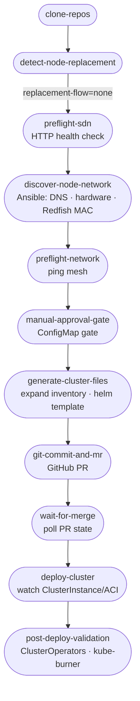
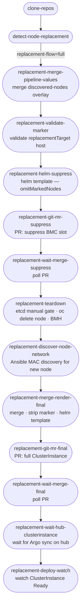

# Chart: ztp-pipeline

Tekton Pipeline: clone → detect replacement → Ansible preflight (DNS, hardware, Redfish MAC discovery) → `helm template` → GitHub PR → wait merge → watch provisioning → optional post-deploy validation.

## Normal flow



## Replacement flow

When `detect-node-replacement` emits `replacement-flow=full`, all normal-flow tasks are skipped and this path runs instead:



## Parameters

| Param | Default | Meaning |
|-------|---------|---------|
| `run-sdn-prechecks` | false | HTTP SDN health check |
| `run-hardware-validation` | true | Ansible hardware/Redfish tags |
| `run-network-connectivity-test` | true | Ansible ping |
| `run-mac-discovery` | true | Redfish MAC discovery (requires Vault + BMC access) |
| `skip-manual-approval-gate` | true | Set false to require ConfigMap approval |
| `run-post-deploy-validation` | false | Spoke ClusterOperator / MCP checks |
| `run-kube-burner-tests` | false | Smoke workload (requires `tektonZtp.images.kubeBurner`) |
| `replacement-execute-destructive` | false | Allow `oc delete` node/BMH on replacement path |
| `pipeline-values-overlay-path` | "" | Repo-relative YAML deep-merged on top of base pipeline values before Ansible/Helm run |

## Hub values (`tektonZtp`)

Set in `hub-clusters/day2/hub-env-values/<env>/<site>/<hub>/values.yaml`:

- `vault.secretName` — Secret in `openshift-pipelines` with `VAULT_ADDR`+`VAULT_TOKEN` for Ansible Vault reads.
- `images.kubeBurner` — optional kube-burner image.
- `manualApproval.timeoutSeconds`, `clusterValidation.timeoutSeconds` — gate/validation timeouts.

## Local render

```bash
helm template tekton-ztp-pipeline ./cluster-automation/spoke-automation/ztp-pipeline \
  -f hub-clusters/day2/hub-env-values/dev/east/dev-hub-east-1/values.yaml | oc apply -f -
```
